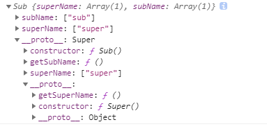

# JS 中的继承


## 原型链继承

重写原型对象，使用父类型的实列

```js
function Super() {
  this.superName = ['super'];
}
Super.prototype.getSuperName = function () {
  console.log(this.superName);
};

function Sub() {
  this.subName = ['sub'];
}

Sub.prototype = new Super();
Sub.prototype.getSubName = function () {
  console.log(this.subName);
};
```

原型链继承存在的问题：
多个子类型的实例对象，操作的父类的引用类型是同一份

```js
const a = new Sub();
const b = new Sub();
b.superName.push('5');
a.getSuperName(); // ["super", "5"]
```

## 借用构造函数继承

将父类的实例复制给子类，使子类具有父类的属性

```js
function Super() {
  this.superName = ['super'];
}

function Sub() {
  Super.call(this);
  this.subName = ['sub'];
}
```

缺陷：

1. 子类的实例化对象不能访问父类原型上的属性
1. 每个子类都对父类进行实例化，影响性能

```js
const a = new Sub();
const b = new Sub();
b.superName.push('5');
a.getSuperName(); //  TypeError: a.getSuperName is not a function
```

## 组合继承

组合上面的两种方法就是组合继承，使用原型链对父类的原型方法和属性进行继承，使用构造函数对实例属性进行继承
并且重写子类 Sub.prototype.constructor，指向子类的构造函数

```js
function Super() {
  this.superName = ['super'];
}
Super.prototype.getSuperName = function () {
  console.log(this.superName);
};

function Sub() {
  Super.call(this);
  this.subName = ['sub'];
}

Sub.prototype = new Super();
Sub.prototype.constructor = Sub;
Sub.prototype.getSubName = function () {
  console.log(this.subName);
};

const a = new Sub();
const b = new Sub();
b.superName.push('5');
a.getSuperName();
```

缺点：

1. 两次调用 Super，分别提供原型链上的属性和实例属性
2. 父类的实例属性在子类的原型和实例上均存在，子类原型上的同名属性无法访问，无意义



## 原型式继承

利用一个对象做媒介，将对象赋值给构造函数的原型

```js
function create(obj) {
  function f() {}
  f.prototype = obj;
  return new f();
}

const a = {
  name: 'a',
  superName: ['super'],
};

const b = create(a);
b.name = 'b';
b.superName.push('b');

const c = create(a);
c.name = 'c';
c.superName.push('C');

console.log(b, c);
```

缺点：

1. 原型链上的引用类型指向相同，不同实例可以修改同一份数据
2. 只能添加到原型链上，无法传递父类参数

## 寄生式继承

在原型式继承上新增加一层，可以给实例新增一些方法

```js
function create(obj) {
  function f() {}
  f.prototype = obj;
  return new f();
}

// 新增
function createV2(obj) {
  const _obj = create(obj);
  _obj.say = function () {
    console.log(this.name);
  };
  return _obj;
}

const a = {
  name: 'a',
  superName: ['super'],
};

const b = createV2(a);
b.name = 'b';
b.superName.push('b');

const c = createV2(a);
c.name = 'c';
c.superName.push('C');

console.log(b, c);
```

缺点： 和原型式继承一样：

1. 原型链上的引用类型指向相同，不同实例可以修改同一份数据
2. 只能添加到原型链上，无法传递父类参数
3. 对每个子实例添加方法属性，不能复用

## 寄生组合式继承

使用一个中间对象作为过渡.子类的原型是一个空对象，而空对象的原型是父类。因此，子类可以访问到父类的属性，而在空对象上添加属性，也不会影响父类。

如果想复用父类构造函数的逻辑，可以在`Sub`内主动调用`Super.call(this)`

```js
function Super(name) {
  this.name = name;
  this.names = name;
  this.isSuper = true;
}

Super.prototype.saySuperName = function () {
  console.log(this.name + 'Super');
};

function Sub(name) {
  Super.call(this);
  this.name = name;
  this.names = [name];
}

Sub.prototype.saySubName = function () {
  console.log(this.name + 'Sub');
};

function F() {}
F.prototype = Super.prototype;
Sub.prototype = new F();
Sub.prototype.constructor = Sub;

Sub.prototype.sayName = function () {
  console.log('after inherit');
};
const a = new Sub('a');
a.names.push('aaaaa');
const b = new Sub('b');

console.log(a, b);
```

以下是一个继承函数的实现：

```js
function inherit(subClass, superClass) {
  subClass.prototype = Object.create(superClass.prototype); //创建父类原型的副本,更新子类的原型
  subClass.prototype.constructor = subClass; // 把子类的构造函数找回来
}

inherit(Sub, Super);

Sub.prototype.sayName = function () {
  console.log('after inherit');
};
const a = new Sub('a');
a.names.push('aaaaa');
const b = new Sub('b');

console.log(a, b);
```
