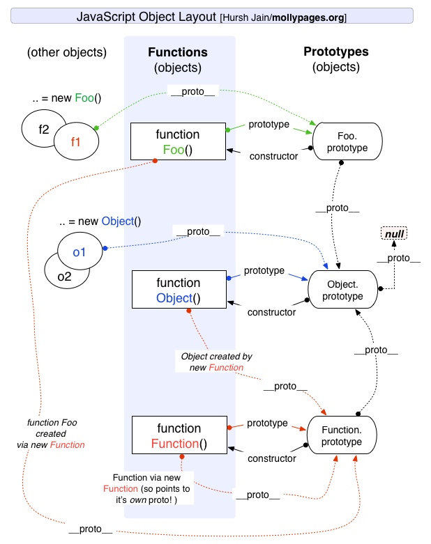

# JS 中的继承



## 原型链继承

重写原型对象，使用父类型的实列

```js
function Super() {
  this.superName = ['super'];
}
Super.prototype.getSuperName = function () {
  console.log(this.superName);
};

function Sub() {
  this.subName = ['sub'];
}

Sub.prototype = new Super();
Sub.prototype.getSubName = function () {
  console.log(this.subName);
};
```

原型链继承存在的问题：
多个子类型的实例对象，操作的父类的引用类型是同一份

```js
const a = new Sub();
const b = new Sub();
b.superName.push('5');
a.getSuperName(); // ["super", "5"]
```

## 借用构造函数继承

将父类的实例复制给子类，使子类具有父类的属性

```js
function Super() {
  this.superName = ['super'];
}

function Sub() {
  Super.call(this);
  this.subName = ['sub'];
}
```

缺陷：

1. 子类的实例化对象不能访问父类原型上的属性
1. 每个子类都对父类进行实例化，影响性能

```js
const a = new Sub();
const b = new Sub();
b.superName.push('5');
a.getSuperName(); //  TypeError: a.getSuperName is not a function
```

## 组合继承

组合上面的两种方法就是组合继承，使用原型链对父类的原型方法和属性进行继承，使用构造函数对实例属性进行继承
并且重写子类 Sub.prototype.constructor，指向子类的构造函数

```js
function Super() {
  this.superName = ['super'];
}
Super.prototype.getSuperName = function () {
  console.log(this.superName);
};

function Sub() {
  Super.call(this);
  this.subName = ['sub'];
}

Sub.prototype = new Super();
Sub.prototype.constructor = Sub;
Sub.prototype.getSubName = function () {
  console.log(this.subName);
};

const a = new Sub();
const b = new Sub();
b.superName.push('5');
a.getSuperName();
```

缺点：

1. 两次调用 Super，分别提供原型链上的属性和实例属性
2. 父类的实例属性在子类的原型和实例上均存在，子类原型上的同名属性无法访问，无意义


