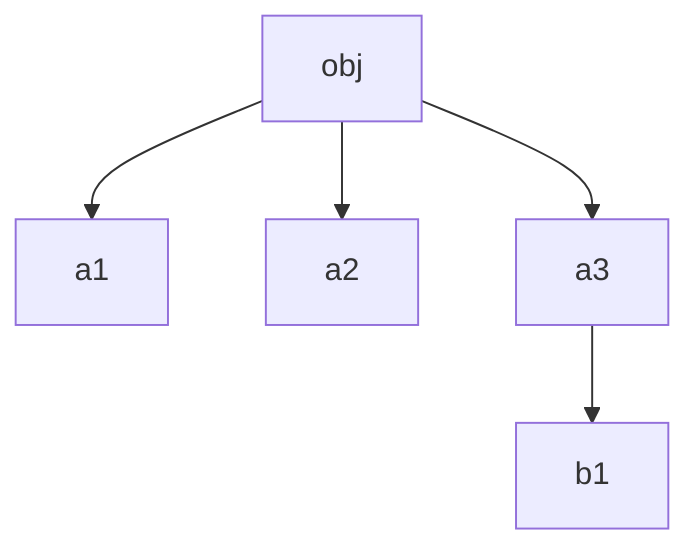

# 浅拷贝与深拷贝

## 赋值操作

> 基础数据类型，赋值后两个变量互不影响。基础数据类型每个变量指向一个内存地址，该内存地址中存放的就是数据的真实值，赋值时相当于把内存中的值复制一份放到新内存中

> 引用数据类型，变量对应的内存地址，实际上存储的是具体内容的内存地址。赋值时，实际上时更新该变量指向的内存地址

```js
const a = {
  name: '1122',
  age: 18,
  father: {
    name: 'sdg',
    age: 45,
  },
};

const b = a;
console.log(b);

a.name = '5566';
a.father.name = 'ggg';
console.log(b.name);
console.log(b.father.name);
```

有些时候我们希望两个变量是独立的，`a` 属性的改变不要影响到 `b`。这时候就需要浅拷贝与深拷贝了

## 浅拷贝

浅拷贝一个引用类型,可以通过`Object.assign()` 或 `...` 运算符实现,实现最外层的拷贝

首先定义一个[`getType()`](JavaScript/变量声明及数据类型/readme.md#objectprototypetostringcall推荐)函数精确的获取数据类型

```js
function shallowClone(obj) {
  const Ctor = obj.constructor;

  if (/^object$/i.test(getType(obj))) {
    return {...obj};
  } else if (/^array$/i.test(getType(obj))) {
    return [...obj];
  } else if (/^date|error|regexp|map|set|weakmap|waeakset$/i.test(getType(obj))) {
    return new Ctor(obj);
  } else if (/^symbol|bigint$/i.test(getType(obj))) {
    return Object(obj);
  } else if (/^function$/i.test(getType(obj))) {
    return function () {
      return obj.call(this, ...arguments);
    };
  } else {
    return obj;
  }
}
```

PS: `Array.prototype.slice()` 和 `Array.prototype.concat()` 也是浅拷贝方法，不会深层次的拷贝

## 深拷贝

深拷贝会拷贝所有的属性，并将每一层的属性都指向一个新的内存地址。不论原始对象的属性怎么修改，都不会影响深拷贝后的对象。反之亦然

### JSON.parse(JSON.stringify(object))

该方法会忽略对象的以下属性：

1. undefiend
2. Symbol
3. 函数属性
4. 循环引用的对象
5. 正则表达式
6. Date

### 递归实现深拷贝

```js
function deepClone(obj, cache = new Set()) {
  if (!/^object|array$/i.test(getType(obj))) {
    return shallowClone(obj);
  }

  // 避免无限套娃  -> 对象的层级下引用了同一个对象
  if (cache.has(obj)) {
    return obj;
  }
  cache.add(obj);
  let Ctor = obj.constructor;

  let keys = [...Object.keys(obj), ...Object.getOwnPropertySymbols(obj)];
  let result = new Ctor();

  keys.forEach((key) => {
    result[key] = deepClone(obj[key], cache);
  });

  return result;
}
```

### 循环实现深拷贝

对于一个引用类型 `obj`，拥有多个层级，可以理解为这是一棵树，每一层都是树的的子节点，因此也可以通过广度优先的方法进行深拷贝

```js
const obj = {
  a1: {},
  a2: {},
  a3: {
    b1,
  },
};
```



下面是具体的实现

```js
function deepClone(obj) {
  const objCtor = obj.constructor;
  const root = new objCtor();
  const loopList = [
    {
      parent: root,
      key: undefined,
      data: obj,
    },
  ];

  while (loopList.length) {
    const node = loopList.pop();
    const {parent, key, data} = node;
    let res = parent;
    // 如果有key，需要创建key对应的节点层次
    if (key !== undefined) {
      const Ctor = data.constructor;
      parent[key] = new Ctor();
      res = parent[key];
    }

    for (let k in data) {
      if (data.hasOwnProperty(k)) {
        if (typeof data[k] === 'object') {
          loopList.push({
            parent: res,
            key: k,
            data: data[k],
          });
        } else {
          res[k] = data[k];
        }
      }
    }
  }
  return root;
}
// test 👇
const obj = {
  a1: {},
  a2: {},
  a3: {
    b1: [5, {c: 5}],
  },
};

let b = deepClone(obj);
b.a3.b1[1].c = 66;

console.log(obj.a3.b1);
console.log(b.a3.b1);
```
